<!-- dRafaleD GitHub Profile README -->
<!-- Inspired by terminal/hacker aesthetic -->

<div align="center">



</div>


<br>


</div>

---

<div align="center">

*"Security is not a product, it's a process."*

<br>

**Think.** `Break.` **Build.** `Repeat.`

</div>

---

## ⊕ TECH ARSENAL

<table>
<tr>
<td valign="top" width="20%">

**🐧 OS & Platforms**
```
► Kali Linux
► Parrot OS
► BlackArch Linux
► CachyOS / Arch
► Debian / Ubuntu
► Windows
```

</td>
<td valign="top" width="20%">

**🔴 Pentesting**
```
► Nmap
► Burp Suite
► Metasploit
► SQLMap
► Wireshark
```

</td>
<td valign="top" width="20%">

**🌐 Web Security**
```
► OWASP ZAP
► Nikto
► Dirsearch
► OpenSSL
► Wafw00f
```

</td>
<td valign="top" width="20%">

**⚡ Exploitation**
```
► MSF
► Payloads
► Privilege Esc.
► Buffer Overflow
► Shellcoding
```

</td>
<td valign="top" width="20%">

**🔧 Reverse Engineering**
```
► Ghidra
► IDA Pro (Free)
► Radare2
► x64dbg / GDB
► Binary Ninja (Free)
```

</td>
</tr>
</table>

---

## </> DEVELOPMENT STACK

<table>
<tr>
<td valign="top" width="25%">

**🟠 Frontend**
```
• HTML5
• CSS3 / SCSS
• JavaScript (ES6+)
• TypeScript
• React
```

</td>
<td valign="top" width="25%">

**🟣 Backend**
```
• Python
• Node.js
• PHP
• Express.js
• Django / Flask
• .NET Core / C#
```

</td>
<td valign="top" width="25%">

**🟡 Databases**
```
• MySQL
• PostgreSQL
• MSSQL
• MongoDB
• SQLite
• Redis
```

</td>
<td valign="top" width="25%">

**⚙️ Other**
```
• REST API
• GraphQL
• JWT / OAuth
• Socket.io
• Docker
```

</td>
</tr>
</table>

---

## ⊕ CORE SKILLS


---

## ⊕ CURRENT FOCUS

```
$ status
> learning  : always
> hacking   : daily
> building  : constantly
> breaking  : ethically
```

**Learn** `──` **Hack** `──` **Build** `──` **Automate** `──` **Secure** `──` **Repeat**

---

## λ CONTRIBUTION ICHTHYOSAUR

<div align="center">

<picture>
  <source media="(prefers-color-scheme: dark)" srcset="https://raw.githubusercontent.com/dRafaleD/dRafaleD/output/github-contribution-grid-snake-dark.svg" />
  <source media="(prefers-color-scheme: light)" srcset="https://raw.githubusercontent.com/dRafaleD/dRafaleD/output/github-contribution-grid-snake.svg" />
  
</picture>

<br><br>

<sub>λ resonance trail active · crowbar ready · black mesa protocol online</sub>

</div>

---

<div align="center">

*"The quieter you become, the more you are able to hear."*

<br>

[](https://www.linkedin.com/in/eren-erdo%C4%9Fan-655084399/)

<br><br>


<br>


<br>


<br><br>

<sub>λ sector clear · access granted · black mesa protocol active</sub>

</div>
