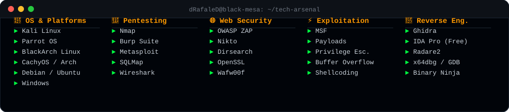
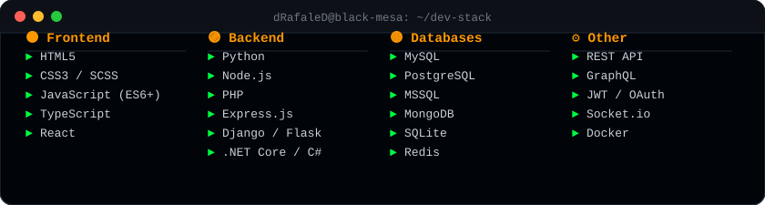
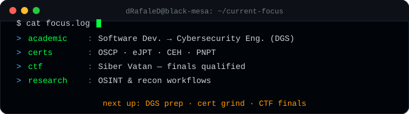

<!-- dRafaleD GitHub Profile README -->
<!-- Terminal / Black Mesa themed -->

<div align="center">



<br>


<br><br>


</div>

<br>

<div align="center">

*"Security is not a product, it's a process."*

**Think.** `Break.` **Build.** `Repeat.`

</div>

---

## LAMBDA SYSTEM.INFO

<div align="center">



</div>

---

## TECH ARSENAL

<div align="center">



</div>

---

## DEVELOPMENT STACK

<div align="center">



</div>

---

## CORE SKILLS

<div align="center">

<sub>grouped signals / offensive / analysis / engineering</sub>

</div>

<table>
<tr>
<td valign="top" width="33%">

**OFFENSIVE**

```txt
Penetration Testing
Web Security
Red Teaming
Vulnerability Assessment
Bug Bounty
Exploit Development
```

</td>
<td valign="top" width="33%">

**ANALYSIS**

```txt
Threat Hunting
OSINT
Reverse Engineering
Binary Analysis
Malware Analysis
Cryptography
```

</td>
<td valign="top" width="33%">

**ENGINEERING**

```txt
Network Security
Secure Coding
Linux Administration
Automation
Problem Solving
```

</td>
</tr>
</table>

<div align="center">


</div>

---

## CURRENT FOCUS

<div align="center">



</div>

---

## CONTRIBUTION ICHTHYOSAUR

<div align="center">

<picture>
  <source media="(prefers-color-scheme: dark)" srcset="https://raw.githubusercontent.com/dRafaleD/dRafaleD/output/github-contribution-grid-snake-dark.svg" />
  <source media="(prefers-color-scheme: light)" srcset="https://raw.githubusercontent.com/dRafaleD/dRafaleD/output/github-contribution-grid-snake.svg" />
  
</picture>

<sub>resonance trail active | crowbar ready | black mesa protocol online</sub>

</div>

---

<div align="center">

*"The quieter you become, the more you are able to hear."*

<br>

[](https://www.linkedin.com/in/eren-erdo%C4%9Fan-655084399/)

<br><br>


<br><br>


<br><br>


<br><br>

<sub>sector clear | access granted | black mesa protocol active</sub>

</div>
