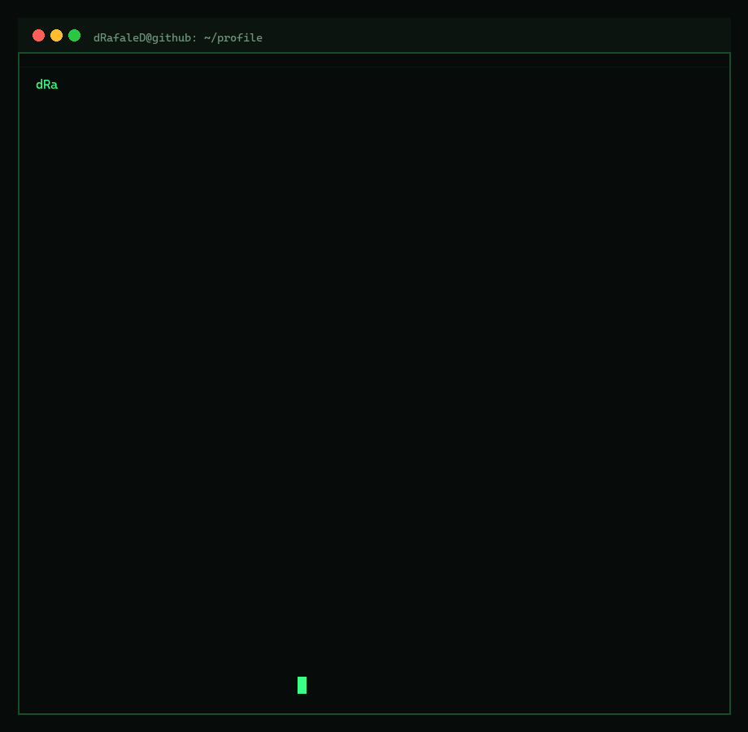

  

## About

I am Eren Erdogan, a backend development student focused on cybersecurity, Linux systems, and secure software development. I build practical tools while improving my skills in penetration testing, OSINT, malware analysis, and full-stack development.

## Tech Stack

Languages

  

  

Development & Databases

  

## Security Focus

- Web application security and penetration testing
- Vulnerability assessment and secure-code review
- OSINT and digital-footprint security
- Malware analysis and reverse-engineering fundamentals
- Binary analysis and exploit-development fundamentals
- Cryptography fundamentals and applied security concepts
- Linux systems, network security, and automation
- Secure backend development

## Currently Learning

- Advanced web application security
- Malware analysis and reverse engineering
- Linux hardening and network security
- Secure API and backend architecture

## Selected Projects

| Project | Description | Stack |
| --- | --- | --- |
| [The-Trackher](https://github.com/dRafaleD/The-Trackher) | Open-source digital-footprint cleaner and OSINT tool. | Python |
| [FhniX](https://github.com/dRafaleD/FhniX) | Local-first phishing email triage with GUI reporting, read-only IMAP scans, and optional local ML. | Python |
| [Banshee](https://github.com/dRafaleD/Banshee) | Systems-oriented project written in Rust. | Rust |
| [Malware-analysis-AsphDex](https://github.com/dRafaleD/Malware-analysis-AsphDex) | Malware-analysis project. | JavaScript |

## Ethics

> All security research and testing is performed in authorized environments only.

## Connect

